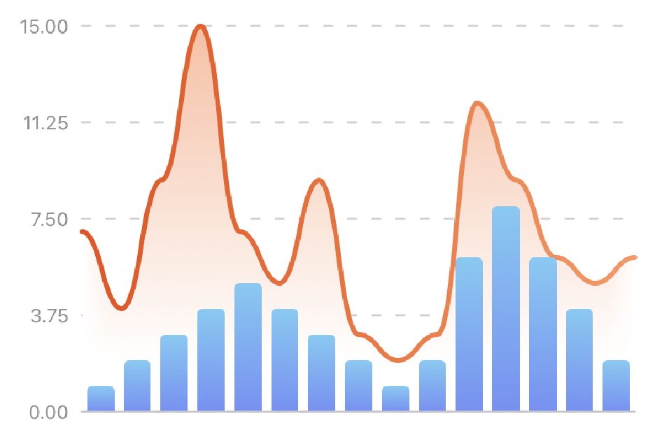

# CoreCharts

CoreCharts is a package for creating beautiful and informational charts in SwiftUI.



# Usage

Each chart can be used as a regular SwiftUI view in your other views.

```swift
BarChart(data: [1, 2, 3, 4, 5, 4, 3, 2, 1])
```

### Combining charts

You can combine multiple charts into one using the `ChatView` view.

```swift
ChartView {
    LineChart(data: lineChartData)
    BarChart(data: barChartData)
}
```

# Charts

Core charts currently includes 3 different charts with unique properties and uses.

### Bar chart

A bar chart displays one bar for each provided data point. Each bar extends up or down all the way to 0 on the Y axis.

```swift
BarChart(data: [Double])
```

### Line chart

A line chart displays a line between subsequent points, forming a line covering the width of the chart. Optionally, the area under the chart is filled with a gradient defined in the chart's `Style`.

```swift
LineChart(data: [Double])
```

### Scatter Plot

A scatter plot shows one point for each provided data point. Optionally, the linear line of best fit can be displayed over the data.

```swift
ScatterPlot(data: [(x: Double, y: Double)])
```

# Modifiers

Each chart has a number of unique modifiers that allow you to customize its appearance and function. There are also a few universal modifiers that can be applied to all charts.

### Universal

#### `labels(position:specifier:)`

Sets the position and specifier for the labels corresponding to the chart. 
By default, when charts are combined the labels are shared between all of the charts, and shown on the left. You can make the charts use separate labels by settings their label positions to different sides.

### Bar chart

#### `style(_:)`

Sets the `Style` of the chart. The `Style` of a `BarChart` determines the colors of the bars and its corresponding label colors.

#### `startColor(_:)`

Sets the starting color of the gradient filling the bars of the bar chart.

#### `endColor(_:)`
